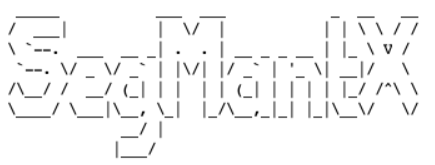
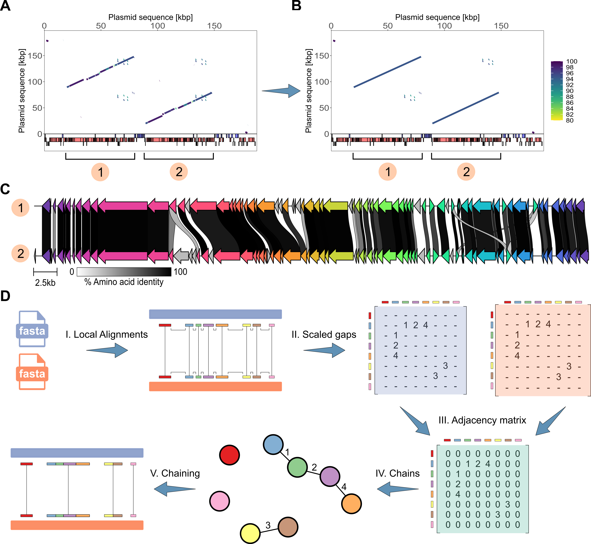
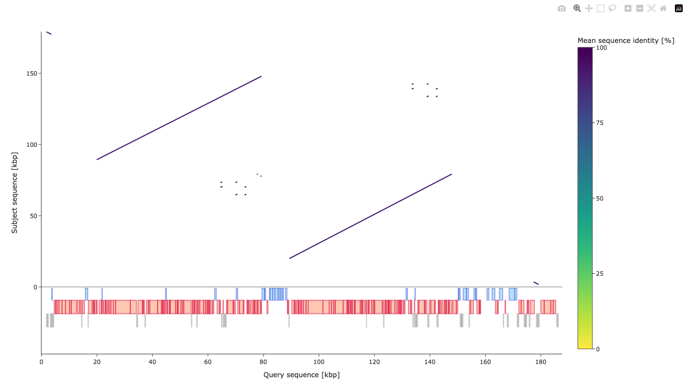

<p align="center">
  
</p>

**SegMantX** is a bioinformatics tool designed for chaining local alignments towards the detection of DNA duplications in genomic sequences. However, SegMantX provides also utilities for chaining local alignments between two different sequences, for example, for sequence comparisons.

<p align="center">
  
</p>

SegMantX workflow integrates BLASTn to compute local alignments as seeds for the chaining process. Nonetheless, the generation of local alignments using BLASTn is optional as the chaining modules accept any input (i.e., seed or alignment coordinates) that provide the following exemplified data:

| Query start | Query end | Subject start | Subject end | Percent sequence identity |
|:-----------:|:---------:|:-------------:|:-----------:|:-------------------------:|
| 133470      | 147930    | 64534         | 78969       | 95.1                      |
| ...         | ...       | ...           | ...         | ...                       |
| 329875      | 330416    | 326586         | 327127     | 93                        |

Note, that for the duplication detection the data corresponds to a self-alignment (i.e., query = subject sequence).

SegMantX is available as a Python-based command-line tool as well as a user-friendly graphical interface app.

## Citation
If you use SegMantX in your research, please cite:

> **Dustin M Hanke, Tal Dagan**, "Title of Paper," *Journal Name*, Year, DOI: [DOI link]

## 📥 Installation
SegMantX can be installed using conda (recommended) or is available via Docker.  

### Prerequisites
- Miniconda or
- Docker

### Suggested installations

### 1. Platform-independent installation
```bash
# Clone the repository
git clone https://github.com/DMH-biodatasci/SegMantX.git
cd SegMantX

# Create and activate a new conda environment from the provided .yml file
conda env create -f SegMantX.yml
conda activate SegMantX
```

### 2. Installation using a linux platform
```bash
# Clone the repository
git clone https://github.com/yourusername/SegMantX.git
cd SegMantX

# Create and activate a new conda environment from the provided .yml file
conda env create -f SegMantX.yml --platform linux-64
# Alternatively: conda env create -f SegMantX.yml --platform linux-aarch64
conda activate SegMantX
```

### 3. Installation using a MacOS platform
```bash
# Clone the repository
git clone https://github.com/yourusername/SegMantX.git
cd SegMantX

# Create and activate a new conda environment from the provided .yml file
conda env create -f SegMantX.yml --platform osx-64
conda activate SegMantX
```

### 4. Installation on Windows
Recommended prerequisites: 
For running SegMantX on Windows, we recommend to install the Windows Subsystem for Linux (WSL).
Afterwards, SegMantX can be installed via the subsystem:

```bash
# Clone the repository
git clone https://github.com/yourusername/SegMantX.git
cd SegMantX

# Create and activate a new conda environment from the provided .yml file
conda env create -f SegMantX.yml --platform linux-64
# Alternatively: conda env create -f SegMantX.yml --platform linux-aarch64
conda activate SegMantX
```

### 5. Docker
```bash
# Clone the repository
git clone https://github.com/yourusername/SegMantX.git
cd SegMantX
docker build -f Dockerfile_SegMantX -t segmantx .
```

Note, the syntax using SegMantX via Docker will change, for example:
```bash
docker run -it --rm segmantx test_modules
```

To save output files to localhost, modify your commands such as:
```bash
docker run -it --rm -v /path/to/host:/data segmantx generate_alignments \
  --query_file /path/to/host/query_file \
  --blast_output_file /path/to/host/blast_output_file \
  --alignment_hits_file /path/to/host/alignment_hits_output_file \
  --is_query_circular \
  --self_sequence_alignment
```

## Usage

### 🧩 SegMantX Module Overview  

**SegMantX** is organized into modules. The main modules are:

```bash
#1. Computes alignments via BLASTn for the chaining modules.
python3 SegMantX.py generate_alignments [options] ...

#2. Chains local alignments from self-sequence alignment (e.g., towards duplication detection). 
python3 SegMantX.py chain_self_alignments [options] ...

#3. Chains local alignments between two sequences (e.g., towards sequence comparisons) 
python3 SegMantX.py chain_alignments [options] ...

#4. Generates a segmentplot (i.e., segments of chaining results) to visualize yielded chains for a sequence.
python3 SegMantX.py visualize_chains [options] ...

#5. Extracts nucleotide sequences using the chained alignment coordinates and saves them as a FASTA file.
python3 SegMantX.py fetch_nucleotide_chains [options] ...
```

Additional module:

```bash
# Downloads a test dataset and verifies the modules. 
python3 SegMantX.py test_modules
```

Addtional SegMantX options:
```bash
# Print out of module overview.  
python3 SegMantX.py help

# Print out of SegMantX's version. 
python3 SegMantX.py version 

# Print out of SegMantX's related DOI.
python3 SegMantX.py citation 
```

### ✅ 1. Verify Installation & Test SegMantX's Modules
Check if the installation was successful by running:
```bash
python SegMantX.py test_modules
#Confirm to download the test dataset with 'yes'
```

### SegMantX as command-line tool

Run SegMantX with the following command to see further options of SegMantX:
```bash
python SegMantX.py -h
```

Run a SegMantX module with the following command to display usage and parameters:
```bash
python SegMantX.py [module] -h 
# e.g., python SegMantX.py generate_alignments -h
```

#### Generate alignments
Run SegMantX's **generate_alignments.py** module to compute seeds for the chaining process:
```bash
#Compute a self-sequence alignment:
python3 SegMantX.py generate_alignments  --query_file tests/NZ_AP022172.1.fasta --blast_output_file tests/NZ_AP022172.1.blast.x7 --alignment_hits_file tests/NZ_AP022172.1.alignment_coordinates.tsv --is_query_circular --self_sequence_alignment

##Compute a sequence alignment between two sequences:
python3 SegMantX.py generate_alignments  --query_file tests/NZ_CP018634.1.fasta --subject_file tests/NZ_CP022004.1.fasta --blast_output_file tests/NZ_CP018634.1_vs_NZ_CP022004.1.blast.x7 --alignment_hits_file tests/NZ_CP018634.1_vs_NZ_CP022004.1.alignment_coordinates.tsv --is_query_circular --is_subject_circular 
```

Output of generate alignments:
| (Default) output filename | Description |
|:----------:|:-----------:|
| blast_output.txt | Output file of BLASTn search in output format 7 |  
| alignment_hits.tsv | Output file restricted to q.start, q.end, s.end, s.start, and percentage sequence identity from BLASTn search, which is sufficient for the chaining modules | 


#### Self-sequence alignment chaining
Run SegMantX's **chain_self_alignments.py** module for chaining a self-sequence alignment (e.g., towards duplication detection):
```bash
python3 SegMantX.py chain_self_alignments --input_file tests/NZ_AP022172.1.alignment_coordinates.tsv --max_gap 5000 --scaled_gap 1 --fasta_file tests/NZ_AP022172.1.fasta --is_query_circular --output_file tests/NZ_AP022172.1.chains.tsv
```

#### Sequence alignment chaining 
Run SegMantX's **chain_alignments.py** module for chaining a sequence alignment (e.g., towards sequence comparison):
```bash
python3 SegMantX.py chain_alignments --input_file tests/NZ_CP018634.1_vs_NZ_CP022004.1.alignment_coordinates.tsv --fasta_file_query tests/NZ_CP018634.1.fasta --fasta_file_subject tests/NZ_CP022004.1.fasta --max_gap 5000 --scaled_gap 1 --is_query_circular --is_subject_circular --min_length 100 -o tests/NZ_CP018634.1_vs_NZ_CP022004.1.chains.tsv
```

Output of chaining modules:
| (Default) output filename | Description |
|:----------:|:-----------:|
| chaining_output.tsv | Main output file of the chaining procedure containing chaining coordinates and metrics |  
| chaining_output.tsv.indices | Output file to trace back original local alignment hits that have been chained | 

#### Visualization
Run SegMantX's **visualize_chains.py** module to visualize chains in an interactive segmentplot:
```bash
#Visualize chaining results of one sequence (i.e., towards duplication detection)
python3 SegMantX.py visualize_chains --input_file tests/NZ_AP022172.1.chains.tsv --scale kbp --output_file tests/NZ_AP022172.1.html --fasta_file_query  tests/NZ_AP022172.1.fasta --query_is_subject --genbank_file tests/NZ_AP022172.1.gbk

#Visualize chaining results of two sequences (i.e., towards sequence comparison)
python3 SegMantX.py visualize_chains --input_file  tests/NZ_CP018634.1_vs_NZ_CP022004.1.chains.tsv --scale kbp --output_file tests/NZ_CP018634.1_vs_NZ_CP022004.1.html --fasta_file_query tests/NZ_CP018634.1.fasta --fasta_file_subject tests/NZ_CP022004.1.fasta
```
Output of visualization module:
| (Default) output filename | Description |
|:----------:|:-----------:|
| plot.html | An interactive visualization (segment plot) of chains that can be opened in any web browser. | 




#### Get chains as nucleotide sequences
Run SegMantX's **fetch_nucleotide_chains.py** module to extract chains as nucleotide sequences from a fasta file:
```bash
#Get sequences for duplication downstream analysis:
python3 SegMantX.py fetch_nucleotide_chains --input_file tests/NZ_AP022172.1.chains.tsv --fasta_file_query tests/NZ_AP022172.1.fasta --output_file tests/NZ_AP022172.1.chains.fasta

#Get sequences for sequence comparison downstream analysis:
python3 SegMantX.py fetch_nucleotide_chains --input_file tests/NZ_CP018634.1_vs_NZ_CP022004.1.chains.tsv --fasta_file_query tests/NZ_CP018634.1.fasta  --fasta_file_subject tests/NZ_CP022004.1.fasta --output_file tests/NZ_CP018634.1_vs_NZ_CP022004.1.chains.fasta
```

Output of visualization module:
| (Default) output filename | Description |
|:----------:|:-----------:|
| chains.fasta | A fasta file containing the nucleotide sequences of yielded chains. |  

### SegMantX as app
Run the SegMantX app with the following command:
```bash
streamlit run app.py
```

or via Docker:
```bash
docker build -f Dockerfile_SegMantX_App -t segmantx_app .
docker run -p 8501:8501 segmantx_app
# Open a browser and navigate to: http://localhost:8501
```

Briefly, the app provides a graphical user interface to SegMantX's main modules via the following pages:

App pages:
1. **Landing page**: Contains a brief description of the SegMantX app. 
2. **Generate alignments**: Graphical user interface to apply **generate_alignments.py** 
3. **Self-alignment chaining**: Graphical user interface to apply **chain_self_alignments.py**  
4. **Alignment chaining**: Graphical users interface to apply **chain_alignments.py**  
5. **Visualize chains**: Graphical user interface to apply **visualize_chains.py**  
6. **Fetch chains**: Graphical user interface to apply **fetch_nucleotide_chains.py**  
 
## Contact
For questions, support, or bug report, open an issue.

