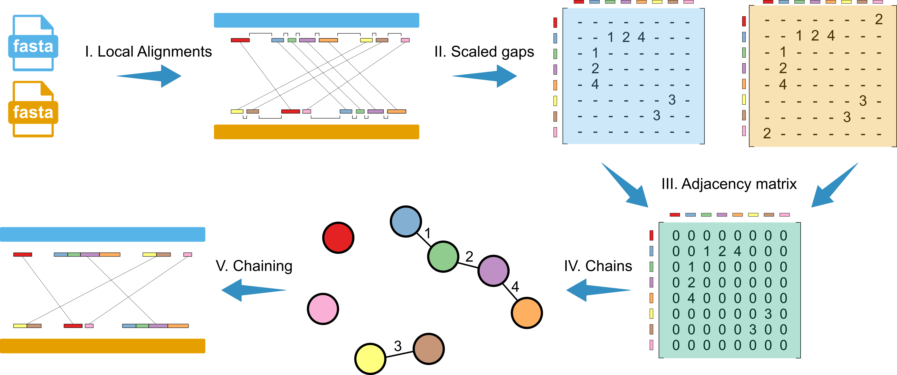
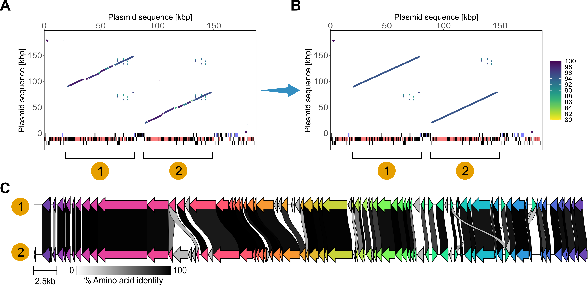

<p align="center">
  
</p>

**SegMantX** is bioinformatics tool intially designed for chaining local alignments from a self-sequence alignment towards the detection of DNA duplications in genomic sequences. The main application purposes of SegMantX are:

1. Duplication detection by chaining local alignments from self-sequence alignment
2. Sequence comparison by chaining local alignments from sequence alignment

Furthermore, SegMantX provide utilities to generate local alignments for chaining, visualize yielded chains in an interactive plot with positional context of the genomic sequence (e.g., see below or [click here to download](https://github.com/DMH-biodatasci/SegMantX/blob/main/docs/img/interactive_example_segmentplot_features.html)), and to extract chains as nucleotide sequences in FASTA-format for downstream analysis.

<p align="center">
  
</p>
<div style="text-align: justify;">
  <small>
    Illustration of steps in the chaining algorithm. (I) The input to the core algorithm is the local alignment data from a replicon against itself (or between two distinct sequences). Colored rectangles show local alignments corresponding to unique putative duplications along the query and subject sequence. (II) Pairwise gaps between local alignments are calculated for both query and subject sequences. (III) The scaled gap matrices for the query and subject sequences are merged into a weighted adjacency matrix, approximating collinearity among local alignments. (IV) Components with positive weights in the adjacency matrix are extracted, capturing local alignments linked by bridged gaps. (V) Local alignments connected in the network are chained together, resulting in newly defined coordinates for the detected segmental duplications.
  </small>
</div>

<p align="center">
  
</p>
<div style="text-align: justify;">
  <small>
    Detection of diverged segmental gene duplications via chaining of local similarity alignments.
    (A) Result of sequence similarity alignment of plasmid sequence used both as query and subject with BLASTn (Camacho et al. 2009). The plasmid pWP5-S18-ESBL-09_1 (NZ_AP022172.1) was reported in <em>E. coli</em> WP5-S18-ESBL-09 (Sekizuka et al. 2022). Lines in the plot correspond to local alignments where the color gradient depicts the proportion of identical nucleotides in the alignment. Colored rectangles in (A, B) correspond to annotated GenBank features such as coding sequences (CDSs) on the plus strand (blue) and minus strand (red). Annotated pseudogenes (grey) indicated below.  
    (B) Results of the chaining algorithm for the same plasmid. Lines in the plot correspond to identified chains (or segments) where the color gradient depicts the mean sequence similarity of local alignments (in proportion of identical nucleotides).  
    (C) Comparison of gene content in the large segmental duplication detected in the above plasmid. Connections between CDS in grey gradients indicate amino acid sequence identities of ≥30%. Likely paralogous genes are colored in the same shade.
  </small>
</div>


## Citation
If you use SegMantX in your research, please cite:

> **Dustin M Hanke, Tal Dagan**, "Title of Paper," *Journal Name*, Year, DOI: [DOI link]

## Manual

Please visit our [manual pages](https://dmh-biodatasci.github.io/SegMantX/) for a full description of SegMantX.

SegMantX's GitHub page only contains a concise description and quick start.

Use the links below to visit the manual of SegMantX's modules:

Core modules:
- [generate_alignments](https://dmh-biodatasci.github.io/SegMantX/command_line_manual/generate_alignments.html)
- [chain_self_alignments](https://dmh-biodatasci.github.io/SegMantX/command_line_manual/chain_self_alignments.html)
- [chain_alignments](https://dmh-biodatasci.github.io/SegMantX/command_line_manual/chain_alignments.html)
- [visualize_chains](https://dmh-biodatasci.github.io/SegMantX/command_line_manual/visualize_chains.html)
- [fetch_nucleotide_chains](https://dmh-biodatasci.github.io/SegMantX/command_line_manual/fetch_nucleotide_chains.html)

Optional modules (and help):
- [test_modules](https://dmh-biodatasci.github.io/SegMantX/command_line_manual/test_modules.html)
- [start_app](https://dmh-biodatasci.github.io/SegMantX/app.html)
- [help](https://dmh-biodatasci.github.io/SegMantX/command_line_manual/help.html)
- [version](https://dmh-biodatasci.github.io/SegMantX/command_line_manual/version.html)
- [citation](https://dmh-biodatasci.github.io/SegMantX/command_line_manual/citation.html)

## Input data:

**SegMantX's** [suggested workflow](https://dmh-biodatasci.github.io/SegMantX/module_overview.html) (only) requires a (genomic) nucleotide sequence in FASTA-format. SegMantX's workflow integrates BLASTn to compute local alignments as seeds for the chaining process. 

Alternatively, the generation of local alignments using BLASTn is optional and can be skipped (e.g., see [suggested workflow](https://dmh-biodatasci.github.io/SegMantX/module_overview.html)) as the chaining modules accept any input (i.e., seed or alignment coordinates) that provide the following exemplified data:

| Query start | Query end | Subject start | Subject end | Percent sequence identity |
|:-----------:|:---------:|:-------------:|:-----------:|:-------------------------:|
| 133470      | 147930    | 64534         | 78969       | 95.1                      |
| ...         | ...       | ...           | ...         | ...                       |
| 329875      | 330416    | 326586         | 327127     | 93                        |

Hint: Chaining local alignments on sequences that are characterized by a circular sequence topology require alignment (coordinate) input data retrieved from an alignment where circular sequences where concatenated with themselves in FASTA-format. 

## Installation:

If you haven't installed SegMantX, yet, please follow one installation procedure that fits for you:

- [Linux](https://dmh-biodatasci.github.io/SegMantX/installation/linux.html)
- [MacOS](https://dmh-biodatasci.github.io/SegMantX/installation/macos.html)
- [Windows](https://dmh-biodatasci.github.io/SegMantX/installation/windows.html)
- [Platform-independent installation](https://dmh-biodatasci.github.io/SegMantX/installation/independent.html)
- [Docker](https://dmh-biodatasci.github.io/SegMantX/docker.html)

Hint: The platform-independent installation may be required for older Miniconda versions.

## Verify installation & test SegMantX's modules
Check if the installation was successful by running:
```bash
SegMantX test_modules #This will download a test dataset in ./tests to test all modules
```

## Quick start

Below we show two examples running SegMantX on the test dataset towards the (I.) duplication detection by chaining local alignments from self-sequence alignment and (II.) sequence comparison by chaining local alignments from sequence alignment.

### I. Workflow towards duplication detection

The following workflow demonstrates the duplication detection computing a self-alignment of a (circular) plasmid sequence. Afterwards, the hits in the self-alignment will processed in the chaining module. An interactive plot visualizing resulting segments (or chains) and a FASTA-file containing the nucleotide chains will be created.

Hint: Use --is_query_circular only if your sequence has a circular sequence topology (e.g., circular plasmids etc.)

1. Run SegMantX's **generate_alignments** module to compute seeds for the chaining process:
```bash
#Compute a self-sequence alignment:
SegMantX generate_alignments --query_file tests/NZ_AP022172.1.fasta --blast_output_file tests/NZ_AP022172.1.blast.x7 --alignment_hits_file tests/NZ_AP022172.1.alignment_coordinates.tsv --is_query_circular --self_sequence_alignment
```

2. Run SegMantX's **chain_self_alignments** module for chaining a self-sequence alignment (e.g., towards duplication detection):
```bash
SegMantX chain_self_alignments --input_file tests/NZ_AP022172.1.alignment_coordinates.tsv --max_gap 5000 --scaled_gap 1 --fasta_file tests/NZ_AP022172.1.fasta --is_query_circular --output_file tests/NZ_AP022172.1.chains.tsv
```

3. Run SegMantX's **fetch_nucleotide_chains** module to extract chains as nucleotide sequences from a FASTA-file:
```bash
#Visualize chaining results of one sequence (i.e., towards duplication detection)
SegMantX visualize_chains --input_file tests/NZ_AP022172.1.chains.tsv --scale kbp --output_file tests/NZ_AP022172.1.html --fasta_file_query  tests/NZ_AP022172.1.fasta --query_is_subject --genbank_file tests/NZ_AP022172.1.gbk
```

4. Run SegMantX's **visualize_chains** module to visualize chains in an interactive segmentplot:
```bash
#Get sequences for duplication downstream analysis:
SegMantX fetch_nucleotide_chains --input_file tests/NZ_AP022172.1.chains.tsv --fasta_file_query tests/NZ_AP022172.1.fasta --output_file tests/NZ_AP022172.1.chains.fasta
```

### II. Workflow towards sequence comparisons
The following workflow demonstrates the sequence comparison computing an alignment between two (circular) plasmid sequences. Afterwards, the hits in the alignment will processed in the chaining module. An interactive plot visualizing resulting segments (or chains) between the two plasmid sequences and a FASTA-file containing the nucleotide chains will be created.

1. Run SegMantX's **generate_alignments** module to compute seeds for the chaining process:
```bash
##Compute a sequence alignment between two sequences:
SegMantX generate_alignments  --query_file tests/NZ_CP018634.1.fasta --subject_file tests/NZ_CP022004.1.fasta --blast_output_file tests/NZ_CP018634.1_vs_NZ_CP022004.1.blast.x7 --alignment_hits_file tests/NZ_CP018634.1_vs_NZ_CP022004.1.alignment_coordinates.tsv --is_query_circular --is_subject_circular 
```

2. Run SegMantX's **chain_alignments** module for chaining a sequence alignment (e.g., towards sequence comparison):
```bash
SegMantX chain_alignments --input_file tests/NZ_CP018634.1_vs_NZ_CP022004.1.alignment_coordinates.tsv --fasta_file_query tests/NZ_CP018634.1.fasta --fasta_file_subject tests/NZ_CP022004.1.fasta --max_gap 5000 --scaled_gap 1 --is_query_circular --is_subject_circular --min_length 100 -o tests/NZ_CP018634.1_vs_NZ_CP022004.1.chains.tsv
```

3. Run SegMantX's **visualize_chains** module to visualize chains in an interactive segmentplot:
```bash
#Visualize chaining results of two sequences (i.e., towards sequence comparison)
SegMantX visualize_chains --input_file  tests/NZ_CP018634.1_vs_NZ_CP022004.1.chains.tsv --scale kbp --output_file tests/NZ_CP018634.1_vs_NZ_CP022004.1.html --fasta_file_query tests/NZ_CP018634.1.fasta --fasta_file_subject tests/NZ_CP022004.1.fasta
```

4. Run SegMantX's **fetch_nucleotide_chains** module to extract chains as nucleotide sequences from a FASTA-file:
```bash
#Get sequences for sequence comparison downstream analysis:
SegMantX fetch_nucleotide_chains --input_file tests/NZ_CP018634.1_vs_NZ_CP022004.1.chains.tsv --fasta_file_query tests/NZ_CP018634.1.fasta  --fasta_file_subject tests/NZ_CP022004.1.fasta --output_file tests/NZ_CP018634.1_vs_NZ_CP022004.1.chains.fasta
```

## SegMantX as app
Run the SegMantX app with the following command:
```bash
#Navigate to the SegMantX directory as this module requires 'app.py'
SegMantX start_app
```

Briefly, the app provides a graphical user interface to SegMantX's main modules. Each page contains a brief description to support the user selecting the correct input data and parameters.

1. **Landing page**: Contains a brief description of the SegMantX app. 
2. **Generate alignments**: Graphical user interface to apply [generate_alignments](https://dmh-biodatasci.github.io/SegMantX/command_line_manual/generate_alignments.html)
3. **Self-alignment chaining**: Graphical user interface to apply [chain_self_alignments](https://dmh-biodatasci.github.io/SegMantX/command_line_manual/chain_self_alignments.html) 
4. **Alignment chaining**: Graphical users interface to apply [chain_alignments](https://dmh-biodatasci.github.io/SegMantX/command_line_manual/chain_alignments.html) 
5. **Visualize chains**: Graphical user interface to apply [visualize_chains](https://dmh-biodatasci.github.io/SegMantX/command_line_manual/visualize_chains.html) 
6. **Fetch chains**: Graphical user interface to apply [fetch_nucleotide_chains](https://dmh-biodatasci.github.io/SegMantX/command_line_manual/fetch_nucleotide_chains.html) 