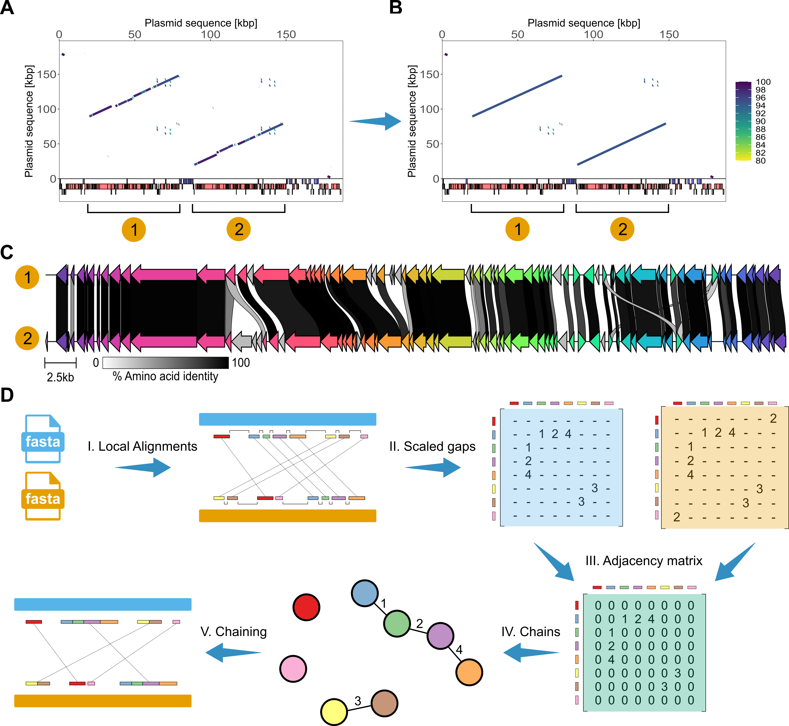

# Home

  

**SegMantX** is a bioinformatics tool designed for chaining local alignments towards the detection of DNA duplications in genomic sequences. However, SegMantX provides also utilities for chaining local alignments between two different sequences, for example, for sequence comparisons.

  

**Detection of diverged segmental gene duplications via chaining of local similarity alignments.** (A) Result of sequence similarity alignment of plasmid sequence used both as query and subject with BLASTn (Camacho et al. 2009). The plasmid pWP5-S18-ESBL-09_1 (NZ_AP022172.1) was reported in E. coli WP5-S18-ESBL-09 (Sekizuka et al. 2022). Lines in the plot correspond to local alignments where the color gradient depicts the proportion of identical nucleotides in the alignment. Colored rectangles in (A, B) correspond to annotated genbank features such as coding sequences (CDSs) on the plus strand (blue) and minus strand (red). Annotated pseudogenes (grey) indicated below. (B) Results of the chaining algorithm for the same plasmid. Lines in the plot correspond to identified chains (or segments) where the color gradient depicts the mean sequence similarity of local alignments (in proportion of identical nucleotides). (C) Comparison of gene content in the large segmental duplication detected in the above plasmid. Connections between CDS in grey gradients indicate amino acid sequence identities of >=30%. Likely paralogous genes are colored in the same shade. (D) Illustration of steps in the chaining algorithm. (I) The input to the core algorithm is the local alignment data from a replicon against itself (or between two distinct sequences). Colored rectangles show local alignments corresponding to unique putative duplications along the query and subject sequence (II) Pairwise gaps between local alignments are calculated for both query and subject sequences. (III) The scaled gap matrices for the query and subject sequences are merged into a weighted adjacency matrix, approximating collinearity among local alignments. (IV) Components with positive weights in the adjacency matrix are extracted, capturing local alignments linked by bridged gaps. (V) Local alignments connected in the network are chained together, resulting in newly defined coordinates for the detected segmental duplications.