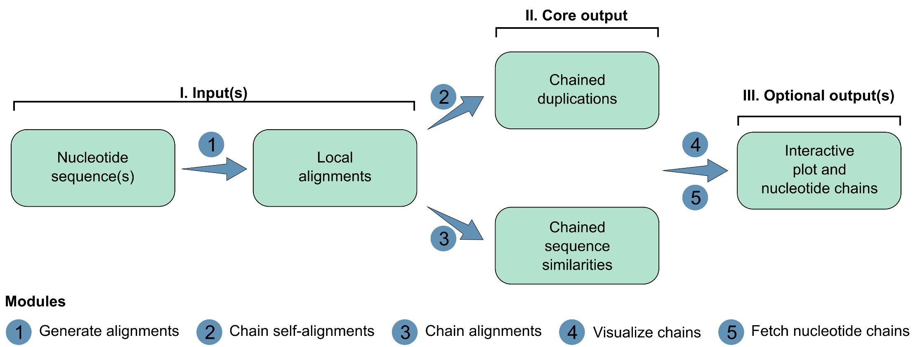

## 🧩 Workflow & Overview

**SegMantX** is organized into modules. The suggested workflow:

  

1. Generate alignments: processes nucleotide sequence(s) to compute local alignments, optionally formatting them for further analysis. 
2. Chain self-alignments: Chains local alignments from self-sequence alignment (e.g., towards duplication detection).
3. Chaing alignments: Chains local alignments between two sequences (e.g., towards sequence comparisons).
4. Visualize chains: Generates a segmentplot (i.e., segments of chaining results) to visualize yielded chains for a sequence (self-alignment) or two sequences (alignment).
5. Fetch nucleotide chains: Extracts yielded chains as nucleotide sequences and saves them as fasta file.
